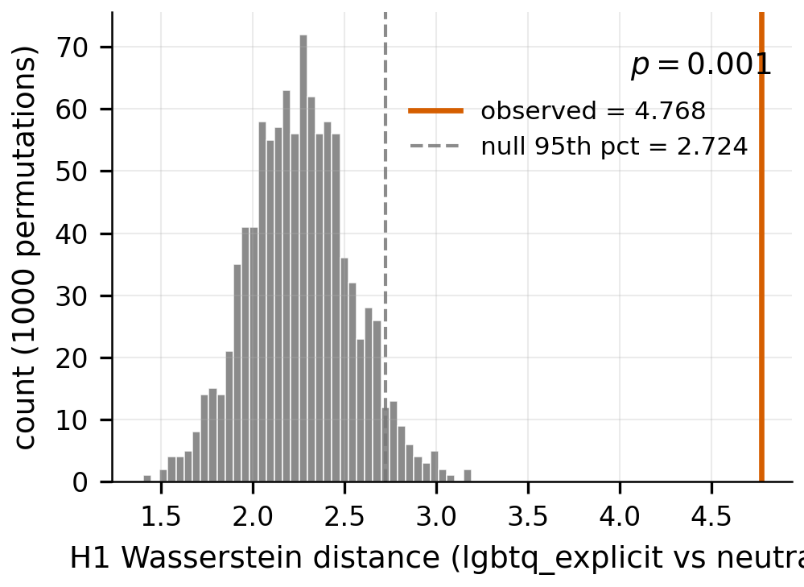
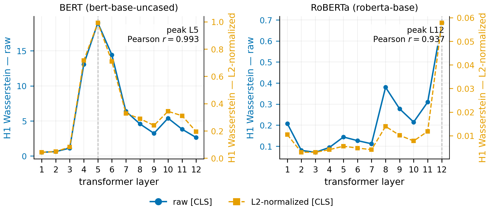
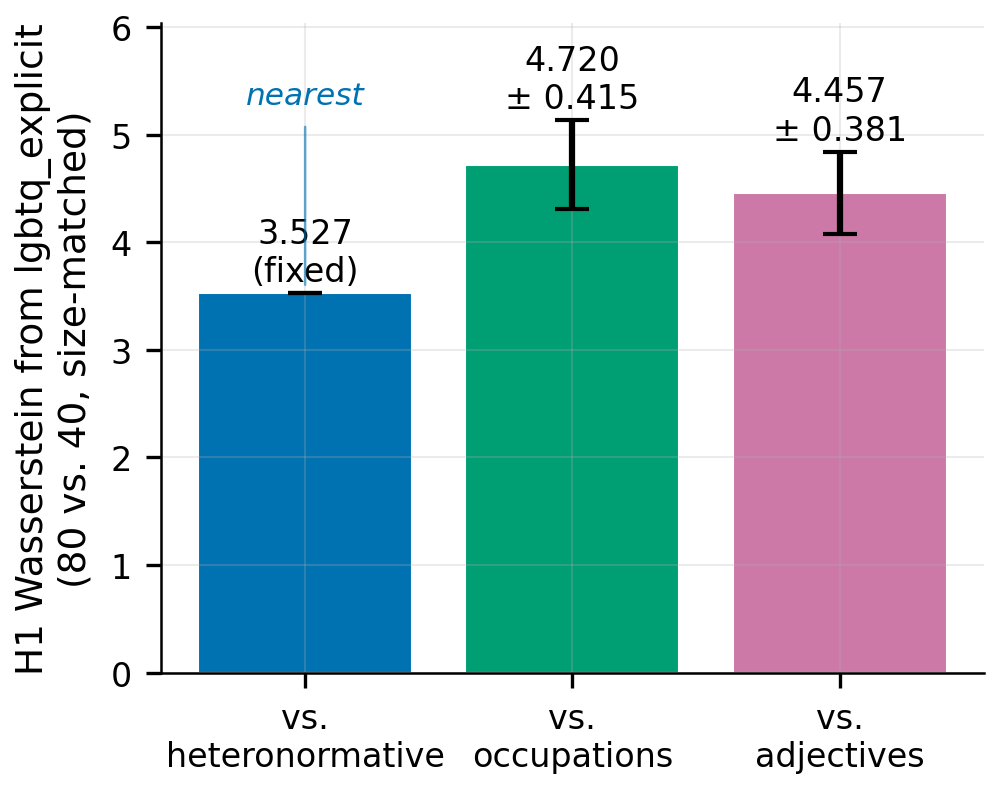
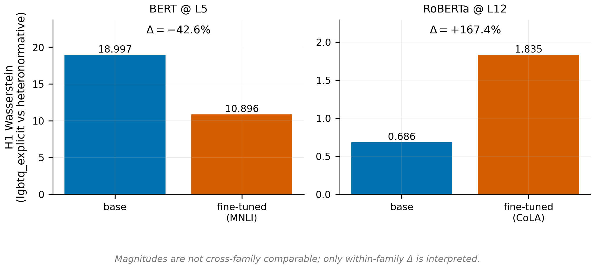
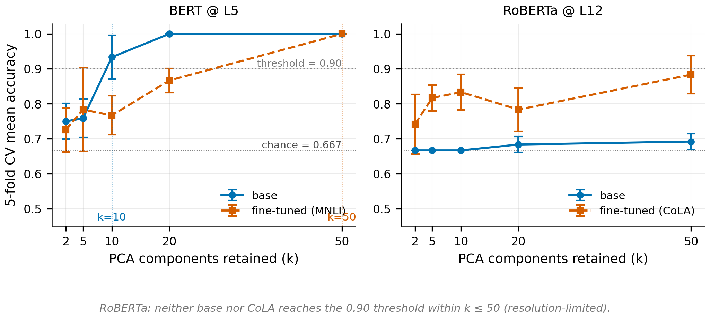

# Downstream Fine-Tuning Reorganizes Identity-Coded Geometry in Transformer Embeddings: A Cross-Architecture Topological Probe

## Abstract

Supervised fine-tuning is widely assumed to attenuate the identity-coded representational structure that pretrained language models inherit from their training data. We show this assumption fails — and fails in opposite directions across architectures, so that "fine-tuning debiases" cannot be stated as a model-agnostic claim. To detect structure that surface audits miss, we introduce a topological probe: treating each group of sentence embeddings as a point cloud, we use persistent homology to characterize its multi-scale geometry, comparing otherwise-identical sentences in which only an identity term varies and quantifying group differences via the Wasserstein distance between persistence diagrams. The signal is real and well-localized: LGBTQ+-coded embeddings are topologically distinct from an identity-neutral baseline (H1 Wasserstein p = 0.001, 1000-permutation test), the effect is not an artifact of subword tokenization, and the orientation cluster crystallizes at a specific depth in each encoder family (layer 5 in BERT, layer 12 in RoBERTa). Against this common foundation, downstream fine-tuning reshapes the geometry in architecture- and task-dependent directions. MNLI fine-tuning disperses BERT's orientation cluster — a 43% drop in H1 Wasserstein distance across ~5× more dimensions — while a linear probe shows the information is fully preserved (100% balanced accuracy, unchanged). CoLA fine-tuning instead amplifies the cluster in RoBERTa (+167% Wasserstein) and, despite carrying no identity-related supervision, introduces linearly recoverable orientation information (probe accuracy 0.54 → 0.83). Fine-tuning is therefore not a reliable debiasing operation: it can hide identity-coded structure from surface audits or create it as a side effect. We demonstrate differential geometric encoding across model families and make no claim of behavioral harm absent further validation.

## 1. Introduction

Large language models inherit social structure from their training data, and a substantial literature documents how that structure surfaces as measurable bias in learned representations [Caliskan et al., 2017; Garg et al., 2018]. As the field has moved to a deploy-by-fine-tuning paradigm, fine-tuning has itself been proposed as a debiasing mechanism: Gira et al. [2022] reduce gender bias by updating under 1% of a model's parameters. Yet the premise that mitigation survives deployment is shakier than it is often treated. Meade et al. [2022] find existing debiasing techniques inconsistent and prone to degrading language-modeling ability; Goldfarb-Tarrant et al. [2021] show that intrinsic bias metrics do not reliably predict downstream application bias; and Steed et al. [2022] find that reducing intrinsic bias before fine-tuning does little to curb discriminatory behavior afterward. The emerging consensus is that bias mitigation does not transfer reliably through fine-tuning. What this literature does not provide is a representational-level account of what fine-tuning actually does to identity-coded structure — and answering that requires a measurement tool sensitive to the right kind of structure.

The dominant probes for representational bias — top-k output inspection, pairwise cosine similarity, and WEAT/SEAT-style association tests [Bolukbasi et al., 2016; Caliskan et al., 2017; May et al., 2019] — are sensitive to directional or pairwise structure: a vector to project out, or a cosine score between two sets. They are blind by construction to how a group's embeddings are globally connected and clustered across scales. Topological data analysis (TDA) is built precisely for that global, multi-scale structure, and two recent results make it the natural instrument for our question. Rathore et al. [2023], with TopoBERT, use the Mapper algorithm to show that fine-tuning does reorganize the topology of a model's embedding space — and that higher layers change more than lower ones — but they study general class structure, with no identity focus and no significance testing. Varadarajan and Songdechakraiwut [2025] use persistent homology, Wasserstein distance, and permutation testing to show that TDA can detect identity-group bias in an LLM — but at the level of individual attention heads, for the purpose of localization, and without examining fine-tuning at all.

These two results bracket an open question. If fine-tuning reorganizes embedding topology in general (TopoBERT), and if identity-coded bias has a detectable topological signature (Varadarajan and Songdechakraiwut), then does fine-tuning's reorganization act selectively on identity-coded subgroup structure — and if so, in a consistent direction? We pose and answer exactly this intersection question: we apply persistent homology not to attention heads but to identity-paired subgroup embedding clouds (otherwise-identical sentences differing only in an identity term, e.g., "a gay person" vs. "a person"), and we ask how downstream fine-tuning reshapes their topology. Our central finding is that it does so, but not uniformly: the same class of intervention moves identity-coded geometry in opposite directions across architectures, so "fine-tuning debiases" cannot be stated as a model-agnostic claim.

Concretely, we compare each subgroup's persistence diagram against an identity-neutral baseline using the Wasserstein distance, with significance assessed by label-permutation tests. We first establish that the signal is real: LGBTQ+-coded embeddings are topologically distinct from neutral ones (H1 Wasserstein p = 0.001, 1000 permutations), the effect is not an artifact of subword tokenization, and it is localized to a specific depth in each encoder family (layer 5 in BERT, layer 12 in RoBERTa). The structure is genuinely topological — invisible to UMAP projection and cosine inspection, which organize the space by sentence template rather than by identity.

Against this foundation, fine-tuning reshapes the geometry in architecture- and task-dependent directions. MNLI fine-tuning disperses BERT's orientation cluster — a 43% drop in H1 Wasserstein distance, spread across roughly 5× more principal-component dimensions — while a linear probe shows the underlying information is fully preserved (100% balanced accuracy, unchanged). CoLA fine-tuning does the opposite to RoBERTa, amplifying the cluster (+167% Wasserstein) and, despite supervising only grammatical acceptability with no identity-related labels, introducing linearly recoverable orientation information where the base model carried almost none (probe accuracy 0.54 → 0.83). The same intervention class thus moves the same quantity in opposite directions depending on the (architecture, task) pair.

We make the following contributions:

1. **A topological probe for identity-coded representational structure.** We apply persistent homology and Wasserstein-distance permutation testing to identity-paired subgroup embedding clouds, capturing global, multi-scale structure that directional and pairwise probes miss by construction.
2. **Evidence that the structure is real, not an artifact.** The LGBTQ+ vs. neutral topological separation is significant (p = 0.001), robust to subword-tokenization confounds, and layer-localized in two encoder families.
3. **A cross-architecture characterization of fine-tuning's effect.** We show fine-tuning reorganizes identity-coded geometry in opposite directions across families — dispersion-without-erasure in BERT+MNLI (information preserved at 100% probe accuracy) versus information gain in RoBERTa+CoLA (probe accuracy 0.54 → 0.83) — and separate geometric reorganization from genuine information change using a PCA-bottleneck and linear-probe analysis.
4. **A scoping caveat for bias auditing.** Because the effect is differential, any claim that fine-tuning debiases must be scoped to a specific (architecture, task) pair. We demonstrate differential geometric encoding across model families and make no claim of behavioral harm absent further validation.

## 2. Related Work

**Bias in embedding geometry.** A long line of work characterizes social bias as geometric structure in learned representations. Bolukbasi et al. [2016] showed that gender bias in static word embeddings is captured by a single direction, with gender-neutral words linearly separable from gender-definitional ones, and proposed to debias by projecting that direction out. Caliskan et al. [2017] formalized bias as differential association via the Word Embedding Association Test (WEAT), and Garg et al. [2018] used embedding distances to track gender and ethnic stereotypes across a century of text. May et al. [2019] extended WEAT to the sentence level (SEAT) for contextual encoders such as ELMo and BERT, while also noting that the test's assumptions do not always hold. What unites these methods is that they probe for directional or pairwise structure — a vector to project out, or a cosine-association score between two sets. Such probes are, by construction, blind to how a group's embeddings are globally connected and clustered across scales. We instead use a multi-scale topological summary that captures exactly this global arrangement.

**Debiasing and whether it survives fine-tuning.** A second body of work asks whether identity structure can be removed, and whether removal persists through deployment. Gira et al. [2022] treat fine-tuning itself as the debiasing mechanism, reducing gender bias by updating under 1% of a model's parameters. But the reliability of mitigation is increasingly in question. Meade et al. [2022] survey five techniques and find them inconsistent — frequently failing to generalize beyond gender and degrading language-modeling ability. Goldfarb-Tarrant et al. [2021] report that intrinsic bias metrics do not reliably correlate with downstream application bias across tasks and languages, undercutting the use of embedding-space measures as proxies for deployed behavior. Steed et al. [2022] test the bias-transfer hypothesis directly and find that reducing intrinsic bias before fine-tuning does little to curb discriminatory behavior afterward, with downstream disparities better explained by fine-tuning-data bias. These results establish that mitigation is inconsistent and that intrinsic and extrinsic measures decouple; what they do not provide is a representational-level account of what fine-tuning does to identity-coded geometry. We supply one, and show the effect is not merely inconsistent but directionally opposite across architectures — dispersion under one (architecture, task) pair, amplification under another.

**Topological data analysis of neural networks.** TDA has mostly characterized whole-network or whole-dataset structure. Naitzat et al. [2020] track how the persistent homology of an entire dataset simplifies as it passes through the layers of a trained classifier, arguing that networks reduce topological complexity with depth. Gabrielsson and Carlsson [2019] apply persistent homology to the space of learned convolutional weights, recovering recurrent global structures across architectures and training. Birdal et al. [2021] derive a persistent-homology intrinsic dimension of the optimization trajectory and link it to generalization. Two recent efforts sit closer to our setting and motivate it directly (Section 1): TopoBERT [Rathore et al., 2023] uses Mapper to visualize how fine-tuning reshapes embedding topology, but over general class structure, without identity focus or significance testing; and Varadarajan and Songdechakraiwut [2025] use persistent homology with Wasserstein permutation tests to localize identity bias to individual attention heads, but do not examine fine-tuning. We target the gap between them: persistent homology on identity-paired subgroup embedding clouds, tracking how fine-tuning reorganizes that geometry.

**Positioning.** Our work sits at the intersection of these three threads. From the first, we inherit the premise that social bias is encoded geometrically — but we replace directional and pairwise probes with a multi-scale topological one that sees structure they cannot. From the second, we inherit the open question of what fine-tuning does to encoded bias — and answer it at the representational level, showing architecture- and task-dependent reorganization rather than uniform attenuation. From the third, we adopt persistent homology as our instrument — but retarget it from global network properties to identity-defined subgroups. While persistent homology has recently been applied to identity-group bias at the level of attention heads [Varadarajan and Songdechakraiwut, 2025], and Mapper-based TDA has been used to study how fine-tuning reshapes embedding topology in general [Rathore et al., 2023], we are not aware of prior work using persistent homology as a targeted probe for how downstream fine-tuning reorganizes identity-coded subgroup structure in embedding space — the intersection these two threads leave open.

## 3. Methods

### 3.1 Stimuli

We construct a controlled stimulus set of minimal pairs (`src/data_gen.py`). Twenty sentence templates (T01–T20) span three context domains — job application (7), social situations (7), and medical (6) — each containing a single `{term}` slot, e.g. *"The physician conducted a routine health examination for {term}."* The slot is filled with identity terms drawn from four groups: `lgbtq_explicit` (four terms: gay, lesbian, bisexual, transgender), `heteronormative` (two: straight, heterosexual), `neutral` (two: the person, they), and `religious_conservative` (two: devout Christian, traditional). Crossing 20 templates with all 10 terms yields 200 sentences (80 `lgbtq_explicit`, 40 each for the other three groups), written to `data/stimuli.csv` with columns `sentence`, `group`, `template_id`, `identity_term`. Because templates are shared across groups, any group-level difference in the resulting embeddings is attributable to the identity term alone.

A tokenization control (`src/token_control.py`) addresses the most common confound in embedding-geometry studies — that rarer identity terms might fragment into more subword tokens and perturb the embedding for that reason alone. Tokenizing each identity term with the model's own tokenizer, we find that all four `lgbtq_explicit` terms and both `heteronormative` terms map to exactly one subword token (`results/token_control.csv`). The two groups are therefore already perfectly length-matched, so the topological separation between them cannot be a subword-fragmentation artifact; the matched-stratum Wasserstein distance is by construction identical to the unmatched one.

### 3.2 Embedding extraction

For the main analysis, sentences are encoded with `sentence-transformers/all-MiniLM-L6-v2` (`src/embed.py`, `src/embeddings.py`), producing 384-dimensional sentence embeddings that are L2-normalized at extraction (`normalize_embeddings=True`). The resulting array (shape 200 × 384) and aligned metadata are persisted to `data/embeddings.npy` and `data/embeddings_meta.csv`. For the layer-wise and fine-tuning analyses we additionally load `bert-base-uncased` and `roberta-base` through HuggingFace `AutoModel` with `output_hidden_states=True` (`src/layerwise.py`, `src/rlhf_compare.py`). Each model exposes 13 hidden states (index 0 = input embeddings, 1–12 = transformer-layer outputs); we take the first-position pooled vector `hidden_states[layer][:, 0, :]` — `[CLS]` for BERT, `<s>` for RoBERTa — as the sentence representation at each layer, batching inputs at size 32 in evaluation mode.

### 3.3 Persistent homology

Each group of embeddings is treated as a point cloud and analyzed with a Vietoris–Rips filtration [Edelsbrunner and Harer, 2010; Carlsson, 2009] via the `ripser` library at `maxdim=1` (`src/tda.py`). Intuitively, as a neighborhood radius grows, points whose neighborhoods overlap become connected; the filtration records when connected components (H0) merge and when one-dimensional loops (H1) are born and later fill in. Each group thus yields a persistence diagram in dimensions 0 and 1 — a coordinate-free, multi-scale summary of the cloud's shape. Diagrams for all four groups are computed and cached to `results/persistence_diagrams.pkl` (`src/tda_pipeline.py`).

### 3.4 Distance metric

To compare two groups we compute the Wasserstein distance between their persistence diagrams, separately for H0 and H1, using `persim` (`diagram_distance` in `src/tda.py`). The Wasserstein distance is the optimal-transport cost of matching the birth–death points of one diagram to those of the other (with the diagonal absorbing unmatched points); a large distance means the two clouds are shaped differently across scales. `src/tda_pipeline.py` assembles the full 4×4 pairwise distance matrices for H0 and H1 into `results/wasserstein_distances.csv`.

### 3.5 Significance testing

We assess significance with a label-permutation test (`notebooks/analysis.ipynb`, §6), applied to the `lgbtq_explicit` vs `neutral` contrast. The 80 `lgbtq_explicit` and 40 `neutral` embeddings are pooled (120 points); under the null hypothesis the identity label is irrelevant, so we shuffle the pooled labels, re-split into groups of size 80 and 40, and recompute the H1 Wasserstein distance, repeating n = 1000 times (seed 42) to build a null distribution. We report the one-sided p-value as `(1 + #{null ≥ observed}) / (n + 1)`, which floors at ≈ 0.001 for 1000 permutations.

### 3.6 Stability

Because absolute H1 Wasserstein magnitudes depend on the number of points in each cloud, we characterize sampling variability with a bootstrap (`src/tda_pipeline.py --bootstrap`). Over 1000 iterations (seed 42), we draw 80% subsamples of each group without replacement (`lgbtq_explicit` 80→64, `heteronormative` 40→32), recompute the H1 Wasserstein distance, and report its mean ± standard deviation and 95% percentile confidence interval, with per-iteration values saved to `results/bootstrap_stability.csv`. The resulting coefficient of variation is low (≈ 5.7%). Because magnitudes are sample-size sensitive, all reported comparisons hold N fixed (80 vs 40), and absolute distances are interpreted only relative to same-N comparators.

### 3.7 Baseline controls

To test whether the `lgbtq_explicit` ↔ `heteronormative` distance is special rather than generic lexical variation, `src/baselines.py` contrasts `lgbtq_explicit` against two additional reference categories built from the same 20 templates: occupations (8 terms: teacher, surgeon, janitor, engineer, nurse, lawyer, plumber, accountant) and random adjectives (8 terms: tall, quiet, friendly, nervous, clever, tired, happy, calm). A naive full comparison uses all 8 control terms (160 sentences) against the 80 `lgbtq_explicit` sentences, but this is confounded by cloud size. The trustworthy comparison is size-matched: each control category is subsampled to 2 terms × 20 templates (40 sentences, matching the `heteronormative` group), and the H1 Wasserstein distance is averaged over 20 random 2-term subsets (seed 42), so every contrast is a fair 80-vs-40 comparison (`results/baseline_sizematched.csv`).

### 3.8 Layer-wise analysis

`src/layerwise.py` localizes where in each encoder the topological separation emerges. For `bert-base-uncased` and `roberta-base`, we extract the pooled `[CLS]`/`<s>` vector at each of the 12 transformer layers for all 200 sentences and compute the per-layer H1 Wasserstein distance between `lgbtq_explicit` and `heteronormative`. Each layer is evaluated twice — on raw `[CLS]` vectors and on L2-normalized (unit-sphere) vectors — because raw magnitudes partly reflect a layer's activation scale; a matching trajectory shape across both variants confirms a peak is a genuine geometric feature rather than a norm-growth artifact. We report each family's peak layer and the Pearson correlation between its raw and normalized trajectories as a scale-invariance check (`results/layerwise_wasserstein.csv`, `results/layerwise_wasserstein_normalized.csv`). Because the two architectures differ in tokenizer, pretraining corpus, and objective, absolute magnitudes are not compared across families; only within-model trajectory shape and raw-vs-normalized agreement are interpreted.

### 3.9 Fine-tuning comparison

`src/rlhf_compare.py` asks whether fine-tuned descendants retain the mid-network orientation structure. Two families are probed: `bert-base-uncased` vs `textattack/bert-base-uncased-MNLI`, and `roberta-base` vs `textattack/roberta-base-CoLA`. The fair within-family comparison (`--per-family-peak`) evaluates each base/fine-tuned pair at that family's own peak layer, read programmatically from the layer-wise results (BERT layer 5, RoBERTa layer 12), and reports the base-vs-fine-tuned change in H1 Wasserstein distance (`results/rlhf_comparison_peak.csv`). We note two scoping caveats carried in the code: the textattack models are supervised downstream fine-tunes (used as tractable proxies for "the same base after a downstream training pass," not RLHF/preference optimization), and because BERT-MNLI and RoBERTa-CoLA were tuned on different tasks, only within-family deltas are compared — never cross-family magnitudes.

### 3.10 Probes

To distinguish geometric reorganization from genuine change in recoverable information, `src/linear_probe.py` fits two probes to the layer-`[CLS]` vectors of the 120 `lgbtq_explicit` + `heteronormative` sentences (768-dimensional), classifying orientation with stratified 5-fold cross-validation (seed 42). The majority-class chance baseline is 66.7% (raw accuracy) / 50% (balanced accuracy). The *full-rank probe* is logistic regression (`max_iter=2000`, `C=1.0`, lbfgs), reporting both raw and balanced accuracy. The *PCA bottleneck probe* projects each `[CLS]` cloud onto its top k principal components for k ∈ {2, 5, 10, 20, 50} — with PCA fit inside each CV fold via a pipeline so no test variance leaks into the projection — fits logistic regression on the projected vectors, and reports the minimum k at which mean accuracy reaches 0.90. This minimum k serves as a quantitative measure of the effective dimensionality of the orientation axis: a larger k means the orientation signal is spread across more directions (`results/linear_probe_peak.csv`, `results/pca_probe_peak.csv`). The same probes are run on the base/fine-tuned pairs at each family's peak layer, so the dimensionality measure is directly comparable before and after fine-tuning.

## 4. Results

### 4.1 The topological signal exists and is robust

The `lgbtq_explicit` ↔ `neutral` H1 Wasserstein distance of **4.769** (`all-MiniLM-L6-v2`, 80 vs. 40 sentences) is highly unlikely under a label-shuffling null (Figure 1). The 1000-iteration permutation null has mean 2.258 (sd 0.279, 95th percentile 2.724), placing the observed value roughly nine standard deviations above the null mean and yielding a one-sided p-value of **0.001** — the floor for n = 1000 (`notebooks/analysis.ipynb`, §6).

**Figure 1.** Permutation test null distribution for the lgbtq_explicit vs. neutral H1 Wasserstein distance. Observed value (red line, 4.769) exceeds all 1000 label-shuffled values, yielding p = 0.001.

Sampling variability around the same estimator is small. A 1000-iteration bootstrap (`src/tda_pipeline.py --bootstrap`) subsampling 80% of each group without replacement (`lgbtq_explicit` 80 → 64; `heteronormative` 40 → 32) gives a tight distribution: mean **2.499 ± 0.142**, 95% CI **[2.214, 2.781]**, coefficient of variation **5.69%** (`results/bootstrap_stability.csv`). The bootstrap mean sits below the full-sample distance (3.527, `results/wasserstein_distances.csv`) because H1 features are sample-size sensitive — a known property of persistent homology that we control for downstream by holding N fixed (80 vs. 40) in every reported comparison.

The signal is not an artifact of subword fragmentation. All four `lgbtq_explicit` terms (gay, lesbian, bisexual, transgender) and both `heteronormative` terms (straight, heterosexual) tokenize to exactly one WordPiece (`results/token_control.csv`), so the two groups are already perfectly length-matched and the token-stratified Wasserstein distance is by construction identical to the unmatched value (3.52702 = 3.52702). And the structure is genuinely topological: it lives in H1 (loop) connectivity rather than gross cluster separation. UMAP organizes the 200 sentences by template — ~20 small clusters, one per scenario, with identity as a within-cluster perturbation — so pairwise cosine and 2-D projection methods cannot see it by construction.

### 4.2 Layer-wise localization differs across architectures

Per-layer [CLS] Wasserstein trajectories localize the `lgbtq_explicit` ↔ `heteronormative` H1 distinction to a single peak in each encoder family, but at **different depths** (Table 1, Figure 2; `results/layerwise_wasserstein.csv`, `results/layerwise_wasserstein_normalized.csv`).

**Table 1.** Per-family peak layer for the lgbtq ↔ heteronormative H1 Wasserstein distance, raw vs. L2-normalized [CLS].

| Model | Raw peak layer | Raw H1 | Normalized peak layer | Normalized H1 | Pearson r (raw vs. L2-norm) |
|---|---|---|---|---|---|
| `bert-base-uncased` | **L5**  | 18.9972 | L5  | 0.9926 | **0.9925** |
| `roberta-base`      | **L12** | 0.6861  | L12 | 0.0578 | **0.9369** |

Within each model, the raw and L2-normalized trajectories agree closely (r = 0.9925 for BERT, r = 0.9369 for RoBERTa), so each peak is a genuine geometric feature rather than an artifact of growing activation norm with depth. We do not compare absolute magnitudes across families — different tokenizer, pretraining corpus, and objective make the numbers incommensurable — but the trajectory shapes differ qualitatively: BERT crystallizes the orientation cluster mid-network (sharp peak at L5, then relaxation), while RoBERTa builds it monotonically toward the output (peak at L12).

**Figure 2.** Per-layer H1 Wasserstein distance (lgbtq_explicit vs. heteronormative) for BERT (left, peak L5) and RoBERTa (right, peak L12). Raw (blue, left axis) and L2-normalized (orange, right axis) curves agree on peak location (BERT r = 0.993, RoBERTa r = 0.937), confirming the peak is geometric structure not a norm-growth artifact.

### 4.3 Baseline controls — the orientation contrast is specific, not generic

To test whether the `lgbtq_explicit` ↔ `heteronormative` distance is special or merely generic lexical variation, we compare it against two control categories built from the same 20 templates: occupations and random adjectives. Controls are subsampled to 2 terms × 20 templates = 40 sentences (matching the `heteronormative` group), and H1 Wasserstein distance is averaged over 20 random 2-term subsets (seed 42), so every contrast is a fair 80-vs-40 comparison (Table 2; `results/baseline_sizematched.csv`).

**Table 2.** Size-matched H1 Wasserstein distance from `lgbtq_explicit` to three reference categories.

| Comparison (80 vs. 40) | Mean H1 Wasserstein | Std | n_subsamples |
|---|---|---|---|
| vs. `heteronormative`        | **3.527** | — (fixed) | 1 |
| vs. occupations              | **4.720** | 0.415     | 20 |
| vs. random adjectives        | **4.457** | 0.381     | 20 |

`heteronormative` lies **2.88 standard deviations below** the occupation mean and **2.44 standard deviations below** the adjective mean (Figure 3). Within MiniLM, the model represents LGBTQ+ and heteronormative terms as **nearest neighbors** on a coherent orientation axis — not as topological outliers from generic lexical variation. The LGBTQ+ cloud is closer to its same-axis contrast than to either unrelated word category.

**Figure 3.** Size-matched H1 Wasserstein distance from lgbtq_explicit to three reference categories (all 80 vs. 40; control values are mean ± std over 20 random 2-term subsets). Heteronormative is the nearest semantic neighbor to lgbtq_explicit, sitting ~2.4 SD below the adjective mean — consistent with a coherent sexual-orientation latent axis.

### 4.4 Fine-tuning reorganizes geometry in opposite directions

Probing each base / fine-tuned pair at its own peak layer (Table 3; `results/rlhf_comparison_peak.csv`, all comparisons 80 vs. 40) shows that supervised downstream fine-tuning moves the `lgbtq_explicit` ↔ `heteronormative` H1 Wasserstein distance in **opposite directions** across families.

**Table 3.** Fine-tuning effect on the orientation cluster at each family's peak layer.

| Family  | Peak layer | Base H1  | Fine-tuned H1 (task) | Δ        | Δ %         |
|---------|------------|----------|----------------------|----------|-------------|
| BERT    | L5         | 18.9972  | **10.8960** (MNLI)   | −8.1012  | **−42.6%**  |
| RoBERTa | L12        |  0.6861  |  **1.8347** (CoLA)   | +1.1486  | **+167.4%** |

The bootstrap-derived coefficient of variation for the H1 Wasserstein estimator (5.69%; §4.1) places both deltas — a 43% compression and a 167% amplification — well outside sampling variability (Figure 4). We report only within-family deltas: BERT-MNLI and RoBERTa-CoLA differ in fine-tuning task as well as in architecture, so the two cases jointly establish *that* the effect is not directionally uniform, but cannot attribute either direction to architecture or task alone.

**Figure 4.** Fine-tuning's effect on H1 Wasserstein distance at each family's peak layer. BERT + MNLI compresses the orientation cluster (Δ = −42.6%, left panel); RoBERTa + CoLA amplifies it (Δ = +167.4%, right panel). Magnitudes are not cross-family comparable (different scales, distinct y-axes); only within-family Δ is interpreted.

### 4.5 Probe analysis disentangles geometric reorganization from information change

Linear probes on the [CLS] vectors of the 120 `lgbtq_explicit` + `heteronormative` sentences (stratified 5-fold CV, seed 42; majority-class chance = 0.667 raw / 0.500 balanced) clarify what each Wasserstein direction means representationally (`results/linear_probe_peak.csv`, `results/pca_probe_peak.csv`).

**Table 4.** Full-rank logistic-regression probe (lgbtq vs. heteronormative) at each model's peak layer. Balanced accuracy reported with 5-fold standard deviation.

| Model                             | Layer | Balanced accuracy | Std    |
|-----------------------------------|-------|-------------------|--------|
| `bert-base-uncased`               | L5    | **1.0000**        | 0.0000 |
| `textattack-bert-base-MNLI`       | L5    | **1.0000**        | 0.0000 |
| `roberta-base`                    | L12   | **0.5375**        | 0.0342 |
| `textattack-roberta-base-CoLA`    | L12   | **0.8250**        | 0.0815 |

For **BERT**, balanced accuracy is at ceiling on both sides of MNLI fine-tuning (1.0000 each, perfect across all five folds) — the orientation information is fully linearly recoverable in either model. For **RoBERTa**, base balanced accuracy (0.5375) sits barely above chance (0.500), while CoLA-tuned balanced accuracy reaches 0.8250 — a **+28.75 percentage-point gain**, well outside the per-fold standard deviations (0.034 and 0.081).

**Table 5.** PCA bottleneck — minimum k for which the same 5-fold probe reaches mean accuracy ≥ 0.90, with accuracy and cumulative explained variance at k = 50 for context.

| Model                            | Min k for acc ≥ 0.90 | Acc at k = 50 | Cum. variance at k = 50 |
|----------------------------------|----------------------|---------------|--------------------------|
| `bert-base-uncased`              | **10**               | 1.000         | 0.991                    |
| `textattack-bert-base-MNLI`      | **50**               | 1.000         | 0.993                    |
| `roberta-base`                   | **> 50**             | 0.692         | 0.991                    |
| `textattack-roberta-base-CoLA`   | **> 50**             | 0.883         | 0.997                    |

For BERT, MNLI fine-tuning preserves information (both reach 1.000 at k = 50) but **disperses it across the principal-component basis**: the minimum k for ≥ 0.90 mean accuracy expands from 10 to 50 — a **5× increase** in the effective dimensionality of the orientation axis, despite nearly identical overall PCA variance profiles (cum-var at k = 50: 0.991 vs. 0.993; Figure 5, left panel). For RoBERTa, neither model clears the 0.90 threshold within k ≤ 50 (base 0.692, CoLA 0.883), so the dimensionality comparison cannot be made at this resolution; the within-family gap nevertheless reproduces the full-rank pattern of Table 4 (Figure 5, right panel).

**Figure 5.** PCA bottleneck probe accuracy vs. number of principal components retained, at each family's peak layer. BERT + MNLI's 5× increase in min-k-for-0.90 (10 → 50) quantifies the orientation-axis dispersion described in §4.5 (left panel). The RoBERTa panel is reported as a resolution limit — neither base nor CoLA reaches 0.90 within k ≤ 50 — but the within-family ordering (CoLA > base across k) reproduces the full-rank probe pattern of Table 4 (right panel).

Synthesizing across the two probes: **BERT + MNLI is geometric reorganization with information preserved** — the −43% Wasserstein compression coincides with zero change in linear recoverability and a ~5× expansion of the dimensionality required to recover it. **RoBERTa + CoLA is genuine information gain** — the +167% Wasserstein amplification coincides with a +28.75 pp gain in linear recoverability at the peak layer, indicating that fine-tuning on a non-identity grammatical-acceptability task injected linearly recoverable orientation structure into a layer that previously carried almost none.

## 5. Discussion

### 5.1 Synthesis: a representational-level account of fine-tuning's effect on identity-coded geometry

The central finding from §4 is that supervised downstream fine-tuning reshapes identity-coded representational geometry, but the **direction** of that reshaping is not architecture- or task-agnostic. Under BERT + MNLI, the `lgbtq_explicit` ↔ `heteronormative` H1 Wasserstein distance compresses by 43% at the family's peak layer while the orientation distinction remains 100% linearly recoverable from the [CLS] vector — geometric reorganization without information loss (Tables 3, 4; PCA-bottleneck mechanism in Table 5). Under RoBERTa + CoLA, the same distance amplifies by 167% at L12, and linear-probe balanced accuracy rises from 0.54 (near chance) to 0.83 — fine-tuning on a non-identity objective injects linearly recoverable orientation structure the base model did not carry (Tables 3, 4).

This sits naturally against the related-work backdrop. Steed et al. [2022] showed that reducing intrinsic bias upstream does little to curb discriminatory downstream behavior; Goldfarb-Tarrant et al. [2021] showed that intrinsic and extrinsic bias metrics decouple across tasks and languages; Meade et al. [2022] found existing debiasing techniques inconsistent. What that literature jointly establishes is that mitigation does not transfer reliably through fine-tuning — but it does not provide a representational account of why. TopoBERT [Rathore et al., 2023] showed fine-tuning reorganizes embedding topology in general, without identity focus or significance testing; Varadarajan and Songdechakraiwut [2025] showed persistent homology can localize identity bias in an LLM, at the attention-head level, without examining fine-tuning. Our results are **consistent with** that body of work and offer a representational mechanism that fits the inconsistency it reports: when the underlying geometry is being reorganized in opposite directions by different (architecture, task) pairs, behavioral measures that aggregate over those pairs will naturally produce inconsistent or non-transferring effects. We do not claim to *explain* prior empirical results — that would require behavioral evaluation of the specific models those studies tested — but the mechanism we observe is the kind of thing that produces the patterns they report.

### 5.2 Two regimes of fine-tuning effect on identity-coded geometry

Our two (architecture, task) pairs occupy qualitatively distinct regimes.

**Regime A — information-preserving geometric reorganization (BERT + MNLI).** Wasserstein compresses by 43% (Table 3); the full-rank linear probe is unchanged at 1.000 balanced accuracy on both sides (Table 4); the PCA bottleneck (Table 5) shows the mechanism — the orientation signal moves from being recoverable in the top 10 principal components in the base model to requiring the top 50 in the fine-tuned model, a 5× expansion of effective dimensionality despite nearly identical overall PCA variance profiles. Surface evaluations relying on dominant directions or pairwise summaries [Bolukbasi et al., 2016; Caliskan et al., 2017; May et al., 2019] are dominated by the leading variance directions; a signal pushed off those directions and into the variance tail will register as "less bias" by those methods while remaining fully linearly recoverable.

**Regime B — information injection (RoBERTa + CoLA).** Wasserstein amplifies by 167% (Table 3); balanced probe accuracy rises by +28.75 pp at the peak layer (Table 4). Critically, the CoLA fine-tuning objective is grammatical acceptability — binary judgments of well-formedness with no identity-related supervision — yet the fine-tuned model encodes the orientation distinction with substantially more linear separability than the base. The mechanism is not resolvable from our experiments. Two non-exclusive candidates are: (i) CoLA's fine-grained linguistic-acceptability supervision amplifies latent group-coded variation already present in the base by sharpening fine-grained linguistic distinctions broadly; or (ii) CoLA induces a representational reshuffling at upper layers (consistent with the RoBERTa peak at L12) that coincidentally aligns previously-diffuse identity-coded variance with newly-prominent task-driven axes. Distinguishing these requires ablation or training-trajectory analysis we have not performed.

The shared lesson is that fine-tuning is not a reliable debiasing operation at the representational level. It can **hide** identity-coded structure from surface audits (Regime A) or **create** it as a side effect of unrelated objectives (Regime B). The two regimes are equally consequential for auditing, even though only one looks like "more bias" on the Wasserstein metric.

### 5.3 Implications for bias auditing practice

Three implications follow, stated as scoping requirements rather than prescriptions.

1. **Surface bias audits and multi-scale geometric probes are complementary, not substitutes.** Regime A demonstrates that a directional or pairwise audit can correctly report "the bias signal has shrunk" while a linear classifier with access to the full vector still recovers the distinction perfectly (Table 4; PCA-bottleneck dispersion in Table 5). Methods sensitive to global, multi-scale geometry — persistent homology, Wasserstein distance over diagrams, or other shape-aware tools — capture structure that directional probes [Bolukbasi et al., 2016; Caliskan et al., 2017; May et al., 2019] cannot. The two families of probe answer different questions about the same representation.

2. **Claims about "fine-tuning effects on bias" cannot be stated model-agnostically.** Our two (architecture, task) pairs produce opposite-direction effects on the same quantity (Table 3), so any such claim must be scoped to the specific (architecture, task) pair on which it was measured. This is a generalization of the Goldfarb-Tarrant et al. [2021] decoupling result from intrinsic-vs-extrinsic to base-vs-fine-tuned within the intrinsic-geometry layer.

3. **Non-identity fine-tuning objectives can introduce identity-coded structure unintentionally.** Regime B shows that a fine-tuning task with no identity supervision can still inject linearly recoverable orientation information into a layer that previously carried almost none. This argues for auditing checkpoints throughout the fine-tuning trajectory, not only base and final models — structure may emerge mid-training as the model adapts to a task whose surface goal is unrelated to identity.

These implications connect back to the bias-transfer hypothesis of Steed et al. [2022]. We do not contradict it; we provide a representational substrate by which it can manifest in **opposite directions** across architectures, consistent with the inconsistency the broader debiasing literature reports.

### 5.4 What we have not shown

Three scoping points before the formal Limitations section.

**We do not demonstrate behavioral harm.** Every result in §4 measures *representational* structure — Wasserstein distance between persistence diagrams, linear-probe accuracy on [CLS] vectors, dimensionality of the orientation axis under PCA. We do not show that models exhibiting Regime A or Regime B patterns produce more toxic, stereotyped, or refusal-prone outputs, nor that downstream task performance (retrieval, ranking, classification) is systematically disparate under identity-coded prompts. Connecting representational reorganization to behavioral outcomes is the natural next step and requires different methodology — counterfactual generation, downstream task evaluation with identity-coded inputs, and human rating — that we have not undertaken.

**We do not disentangle architecture from fine-tuning task.** BERT is paired with MNLI in our experiments; RoBERTa is paired with CoLA. The two cross-family cases differ in both dimensions simultaneously, so we cannot attribute the Regime A vs Regime B contrast to architecture, to fine-tuning task, or to their interaction. The decisive follow-up is to cross the design — `bert-base` + CoLA and `roberta-base` + MNLI (and similar paired comparisons) — and observe whether direction tracks the architecture or the task. We flag this as the most important immediate next experiment.

**Our results are encoder-only.** We probe two BERT-family encoder architectures and their supervised downstream fine-tunes. Decoder-only language models, instruction-tuned models, and true preference-optimized models (DPO, PPO, RLHF) may behave differently. RLHF, in particular, differs from supervised fine-tuning in objective (preference modeling, not classification), training dynamics, and typical scale, so "RLHF disperses bias" cannot be inferred from MNLI/CoLA fine-tuning. Our results scope cleanly to supervised downstream fine-tuning of encoder models; extending them is future work.

We address each of these and adjacent scoping concerns in detail in §6.

## 6. Limitations & Future Work

We expand the scoping points raised in §5.4 and add two further limitations of methodological scope. Each is paired with its concrete follow-up direction.

1. **Architecture/task entanglement.** Our cross-family comparison pairs BERT with MNLI and RoBERTa with CoLA, conflating the architectural factor with the fine-tuning task factor. The opposite-direction Wasserstein effects we observe (Table 3) could in principle reflect either, and our experiments cannot separate them. *Future work:* cross-tuning experiments — `bert-base-uncased` + CoLA and `roberta-base` + MNLI — would disentangle these factors, but require running fine-tuning rather than downloading existing checkpoints.

2. **Scope of fine-tuning regimes.** We use supervised downstream fine-tuning on established benchmarks (MNLI, CoLA, via the `textattack` model release) as a tractable proxy for "what happens after fine-tuning." This proxy does not cover reinforcement learning from human feedback (RLHF), direct preference optimization (DPO), instruction-tuning, or other alignment-style training regimes whose objectives and dynamics differ substantially from supervised classification. *Future work:* applying the probe to checkpoint pairs from genuine preference-optimized or instruction-tuned models would test whether the two regimes we identify generalize beyond supervised fine-tuning.

3. **Encoder-only scope.** Our results are restricted to encoder architectures (`bert-base-uncased`, `roberta-base`, `all-MiniLM-L6-v2`). Decoder-only models (GPT, Llama, Mistral families) compute representations under causal-attention masking and different training objectives, and dual-encoder retrieval models pool representations differently; either family may exhibit different layer-localization or fine-tuning effects than we report here. *Future work:* extending the probe across architecture families would establish whether the two-regime characterization is encoder-specific or representational-bias-general.

4. **Template-based stimuli.** Our identity-paired sentences are synthetic minimal pairs constructed from 20 templates across three context domains (§3.1). Naturalistic text contains pragmatic context, discourse structure, and intersectional identity variation that template stimuli cannot capture, and effects measured under template control may be amplified or attenuated under naturalistic distribution. *Future work:* deploying the probe on curated naturalistic stimulus sets, and on intersectional identity combinations (e.g., race × orientation, gender × disability), would test the probe's external validity.

5. **Representational asymmetry ≠ behavioral harm.** Every result in this paper measures *representational* structure — Wasserstein distance between persistence diagrams, linear-probe accuracy on [CLS] vectors, dimensionality of the orientation axis under PCA. We have not shown that the Regime A or Regime B patterns produce measurable behavioral disparities in downstream tasks (retrieval, ranking, classification, generation). *Future work:* linking the geometric patterns documented here to behavioral outcomes — via counterfactual evaluation, downstream task disparity analysis, and human rating — is the prerequisite for any claim about deployed model behavior that draws on this kind of representational evidence.

## 7. Conclusion

Across two encoder families, supervised downstream fine-tuning reshapes the topological structure of identity-coded subgroup embeddings in opposite directions at each family's peak layer, and within-family linear probes show the two effects to be qualitatively distinct — geometric reorganization with information preserved in one regime, information injection in the other. We introduce persistent homology with Wasserstein permutation testing on identity-paired subgroup embedding clouds as a representational-level probe that captures global, multi-scale structure that directional and pairwise audits cannot see. The broader takeaway for bias-auditing practice is that supervised downstream fine-tuning is not a reliable representational debiasing operation; any claim about its effect must be scoped to the specific (architecture, task) pair on which it was measured. The research program this opens — disentangling architecture from task across encoder and decoder families, and linking these geometric patterns to behavioral outcomes — is the natural next set of experiments.
